<p align="center">
  
</p>

<p align="center">
  <a href="https://al-scripting.github.io/about-me/"><b>→ portfolio</b></a> ·
  <a href="https://www.linkedin.com/in/al-mohamed-shifan-5266b924b"><b>→ linkedin</b></a> ·
  <a href="https://al-scripting.github.io/about-me/assets/Al-Shifan-Resume-2026.pdf"><b>→ cv</b></a>
</p>

```bash
$ ./whoami --verbose

  name    : Al Muqshith Shifan
  role    : MSc CS @ Ontario Tech · network engineer by trade, dev by obsession
  domain  : where deep RL, programmable networks, and game dev collide
  status  : teaching agents to play games & networks to route themselves
```

### 👾 game dev & AI agents

I like building things that *play*. My favorite bugs are the ones where the agent finds a strategy I never intended.

- **[RIDGE](https://github.com/Code-SorceryLab/RIDGE)** — one PPO agent, three personas (Explorer / Survivor / Craftsman) blended with smooth sigmoids on the **Crafter** environment. It learns to survive by *vibe*.
- **[Local-AI-Dungeon](https://github.com/Al-Scripting/Local-AI-Dungeon-Ollama-Python)** — a fully offline text-adventure engine. A lightweight Python game loop wired into a local **Gemma 3 / Ollama** model. No cloud, no leash.
- **Re;Animate '26** — 🏆 1st place. Built a turn-based tactics game in **AMOS BASIC** on an Amiga, because constraints breed creativity.

### 🛠️ software design & the stack

I care about clean systems as much as clever ones — the kind you can read six months later without crying.

```
languages   ██████████  python  js  c
ml / rl     ████████░░  pytorch  gymnasium  ppo
networking  █████████░  p4  cisco (ccna)  ios-xe
tooling     ███████░░░  git  docker  linux  ollama
```

### 📡 reach me

```bash
$ curl -s al-scripting.github.io/about-me   # the full story lives here
$ mail -s "let's build something" → links up top
```

---

<p align="center"><i>// still convinced the best software feels a little like a game.</i></p>
<p align="center">
  
</p>

<p align="center">
  <a href="https://al-scripting.github.io/about-me/"><b>Portfolio</b></a> ·
  <a href="https://www.linkedin.com/in/al-mohamed-shifan-5266b924b"><b>LinkedIn</b></a> ·
  <a href="https://al-scripting.github.io/about-me/assets/Al-Shifan-Resume-2026.pdf"><b>CV</b></a>
</p>

---

### 🧭 About

MSc Computer Science student at **Ontario Tech University**, researching AI agents and software engineering. Network engineer by trade, developer by passion — I build software that automates, analyzes, and optimizes the networks I run.

- 🔭 Working at the intersection of **Network Security, AI, and Full-Stack Development**
- 🌐 Hands-on with **P4 programmable switches**, Cisco labs (**CCNA**), and DRL traffic optimization
- 💬 Ask me about networking, reinforcement learning, or full-stack research tools
- 📍 Oshawa, ON — Canada

### 🛠️ Tech & Tools


### 📂 Featured Projects

- **[RIDGE](https://github.com/Code-SorceryLab/RIDGE)** — A single PPO agent blending Explorer, Survivor, and Craftsman reward weights via sigmoid functions on the Crafter environment.
- **[Local-AI-Dungeon-Ollama-Python](https://github.com/Al-Scripting/Local-AI-Dungeon-Ollama-Python)** — A fully local, privacy-friendly text-adventure engine powered by Gemma 3 / Ollama.
- **[Steam-Gift-Helper](https://github.com/Al-Scripting/Steam-Gift-Helper)** — Full-stack app that recommends Steam gifts by analyzing a friend's library and wishlist.

---

<p align="center"><i>🎯 Currently focusing on DRL for network optimization.</i></p>
